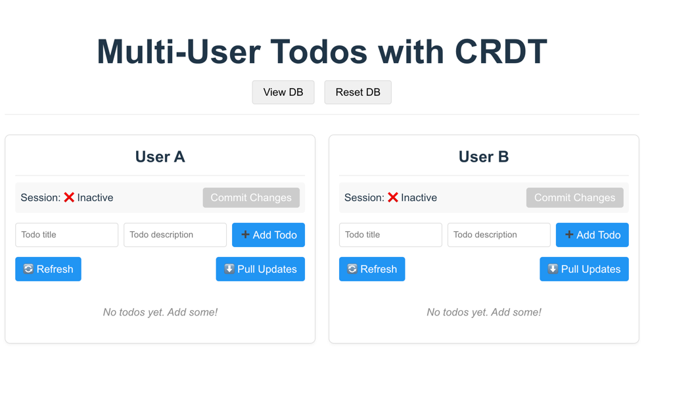

To set up the **crdt-todo-list** project locally, follow these steps:

1. **Clone the Repository**:
   ```bash
   git clone https://github.com/devheniik/crdt-todo-list.git
   ```
   This command clones the project repository to your local machine.

2. **Navigate to the Project Directory**:
   ```bash
   cd crdt-todo-list
   ```
   Change into the project's root directory.

3. **Install Dependencies**:

    - **Frontend**:
      ```bash
      cd frontend
      npm install
      ```
      This installs the necessary packages for the frontend service.

    - **Backend**:
      ```bash
      cd ../backend
      npm install
      ```
      This installs the necessary packages for the backend service.

4. **Launch MongoDB Using Docker**:
   Ensure you have Docker installed on your system. To start a MongoDB container, run:
   ```bash
   #cd crdt-todo-list
   cd ../
   docker-compose up -build
   ```
   This command pulls the latest MongoDB image, names the container "mongodb", maps port 27017 to your local machine, and runs it in detached mode.

5. **Start the Backend Server**:
   ```bash
   cd backend
   npm start
   ```
   This command starts the backend server.

6. **Start the Frontend Server**:
   Open a new terminal window or tab, then navigate to the frontend directory and start the server:
   ```bash
   cd frontend
   npm start
   ```
   This command starts the frontend development server.

7. **Access the Application**:
   Open your browser and navigate to `http://localhost:5173` to use the to-do list application.

**Note**: Ensure that the MongoDB service is running and both the backend and frontend servers are active for the application to function correctly.

For more detailed information on setting up similar projects, you can refer to the [crdt-todo-app](https://github.com/chtushar/crdt-todo-app) repository. 
